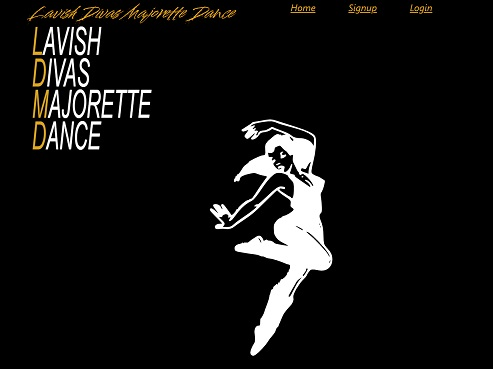
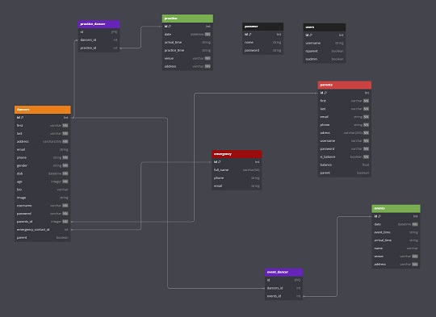
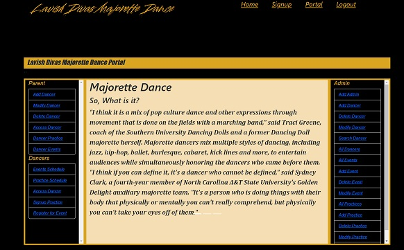
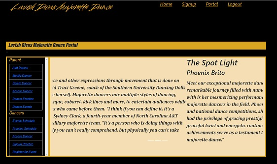
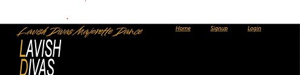
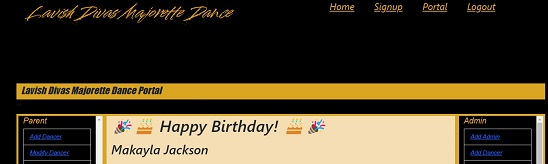

# Lavish Divas

### Welcome to the Lavish Divas' Website.

I chose this making this app for my capstone for a couple of  reasons:
- The owner needs a central place to manage her dance program. 
- I needed a project with a purpose.  

Get so much satisfaction out of finding a problem and/or need and solving it. Its one of the reasons I enjoy coding so much. 

### Getting Started:
- Clone down the [lavish](https://github.com/gisellec60/lavish) repo 
- cd into client folder
- run npm install; npm start
- cd into server folder
- pipenv install; pipenv shell
- python app.py 

Lavish Divas consist of 7 tables:
- dancers 
- parents
- emergency
- practice
- events
- event_dancer
- practice_dancer
- users
- password

relationship : one-to-many
parent > dancers 
emergency > dancers
dancers forgeignKey: parent_id, emergency_id

relationship: many-to-many 
dancers <> events
dancers <> practices
relational tables: event_dancer practice_dancer

stand-alone tables:
users: all dancers, parents, admin
password: admin password

Some of the forms are populated for ease of use. They contain "initialValues" that are populated and a copy of "initalValues" that is empty and commented out. To change to an empty form simply uncommented the empty "initalValues" and comment out the populated one. 

Below is a list of the forms that are populated, located in the src/components

- Login: Login/Login.js
- Signup: Signup/Signup.js
- Delete Dancer: DeletedDancer/DeleteDancer.js
- Modify Dancer: ModifyDancer/GetDancer.js 
- SearchDancer.js: Getform/Getform.js

***Note on Forms:*** All the forms that *add* information (dancers, events, practice) refresh to empty after submission just incase the user wants to enter more than one item of information. However, if the form is pre-populated then the form will refresh to the pre-populated information. 

## Start:
Select login and hit submit and click ok. This will take you to the portal:

Because giselle@gmail.com is an admin you are taken to the **Admin** view.  

This is the view of someone who does not have admin access. Notice the admin portal is missing. This is to prevent access to anyone without admin privilege.

Another interesting view:

Initially, a user has 2 options (*they're already on home*) they either login, or signup. Once the user logins or signs up, Logout and Portal appear while Login disappears:

### Access
There are 3 levels of access:
- Dancer
- Parent
- Admin

Dancer has the least amount of access while the Admin has full access. 

There are some constraints in place to ensure the integrity of the app as well as the Lavish Diva's dance club. 

Parent of the dancer or an admin can perform the following on behalf of a dancer:

 - Add Dancer
 - Delete Dancer
 - Delete Dancer from an Event
 - Delete Dancer from Practice Schedule
 
Dancer, Parent of Dancer and Admin:

- Modify Dancer
- List Dancer
- List All Events for Dancer
- List All Practices for Dancer 
- Add Dancer to Event
- Add Dancer to Practice Schedule
 
Everyone:

- List Practice Schedule
- Event Schedule

## Some Caveats:
While most actions are straight forward there are some that require a little more handling under the covers to keep the integrity of the app. 

 ### **Adding a Dancer:**
 A dancer will not be added to the roster without a parent and an emergency contact. 

 The initial sign up for parent and dancer is through the Signup option on the main menu. Any subsequent dancers added to that parent are done through **Add Dancer** on the Portal. 

### **Add Admin**
Only an an Admin can add someone as an Admin. You don't have to be registerd to be added as an Admin. If a parent is added as an Admin their portal view will change to admin view.   

### **Delete Dancer**
When a dancer is deleted the parent is removed from the parent and user tables and logged out of the app ***except***:
- Parent is an admin  
  **or**
- Parent still has dancers registered

# What's Next?

There is  more functionality that needs to be added:

- Make sure a dancer is not added as an admin. 
- Adding Dancers to Event and Practice Schedules
- Create a portal view that's specific to Parent, dancer and Admin
- Add Pictures from Events
- Event Page
--  directions, resteraunts, hotels, places of interest
- Add Payment link to Parent View
- List Payment balances
- Send reminder email for late payments

As I grow as a developer the app will grow so,...***stay tuned***

 

